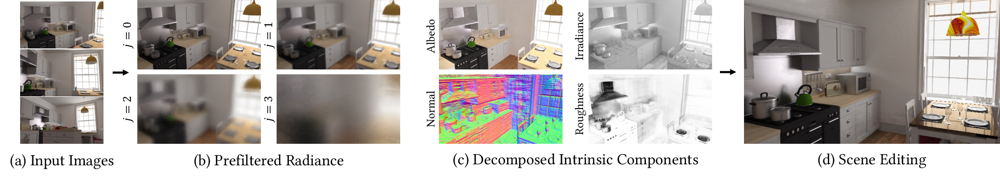

# IBL-NeRF
Official implementation of the paper "IBL-NeRF: Image-Based Lighting Formulation of Neural Radiance Fields".
<div style="text-align:center">

</div>

### [Paper](https://arxiv.org/abs/2210.08202) | [Data](https://drive.google.com/drive/folders/1ejnk8VYVGAvfapZeTUxKmcfH7RAMVK7U?usp=share_link)
## Overview
We propose IBL-NeRF, which decomposes the neural radiance fields (NeRF) of large-scale indoor scenes into intrinsic components.
Previous approaches for the inverse rendering of NeRF transform the implicit volume to fit the rendering pipeline of explicit geometry, and approximate the views of segmented, isolated objects with environment lighting.
In contrast, our inverse rendering extends the original NeRF formulation to capture the spatial variation of lighting within the scene volume, in addition to surface properties.
Specifically, the scenes of diverse materials are decomposed into intrinsic components for image-based rendering, namely, albedo, roughness, surface normal, irradiance, and prefiltered radiance.
All of the components are inferred as neural images from MLP, which can model large-scale general scenes.
By adopting the image-based formulation of NeRF, our approach inherits superior visual quality and multi-view consistency for synthesized images.
We demonstrate the performance on scenes with complex object layouts and light configurations, which could not be processed in any of the previous works.

<!--
## Method
### Intrinsic Decomposition
IBL-NeRF decomposes the baked radiance in NeRF into intrinsic components.
<div style="text-align:center">

</div>


### Prefiltered Radiance Fields
<div style="text-align:center">

</div>

## Applications
### Material Editing

### Object Insertion
-->
___

## Installation
### Environment Setup
We tested IBL-NeRF in Ubuntu 20.04 with RTX 3090 GPU. With proper version of CUDA toolkit, it would work on other environments.
```
git clone https://github.com/changwoonchoi/IBL-NeRF.git
cd IBL-NeRF
conda create -n IBL-NeRF python=3.8
conda activate IBL-NeRF
pip install torch==1.7.1+cu110 torchvision==0.8.2+cu110 -f https://download.pytorch.org/whl/torch_stable.html
pip install -r requirements.txt
```

### Dataset
We provide the dataset we test in the paper.
The dataset includes rendered images with path tracer with its corresponding camera parameter.
Also, the dataset contains intrinsic components (albedo, irradiance, normal, and roughness) for evaluation.
Put the data in the directory "data/".
### Prior Loss
To impose prior loss ($\mathcal{L}_{\text{prior}}$ and $\mathcal{L}_{I,\text{reg}}$), you need to run single-image based intrinsic decomposition algorithms.
We used Bell et al.[[Link](https://github.com/seanbell/intrinsic)] to generate the pseudo albedo and irradiance maps.
Also, we used Tinghui Zhou et al.[[Link](https://github.com/tinghuiz/learn-reflectance)] for the additional results in the supplementary material.
You can run the algorithm yourself, but we provide the results of the algorithm in the dataset.

## Training IBL-NeRF
To train IBL-NeRF in the <span style="font-variant:small-caps;">Kitchen</span> scene, run the scripts below.
```
cd src
python train.py --config ../configs/IBL-NeRF/kitchen.txt
```

## Citation
Cite as below if you find this paper and repository are helpful to you:
```
@article{choi2022ibl,
  title={IBL-NeRF: Image-Based Lighting Formulation of Neural Radiance Fields},
  author={Choi, Changwoon and Kim, Juhyeon and Kim, Young Min},
  journal={arXiv preprint arXiv:2210.08202},
  year={2022}
}
```